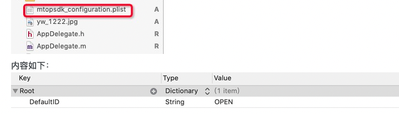
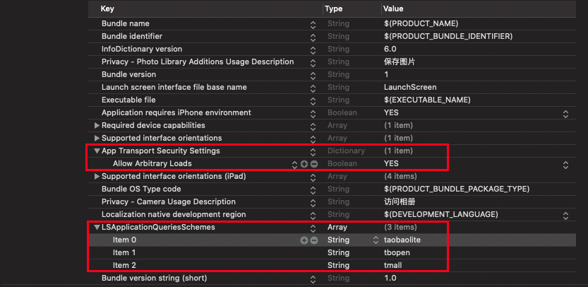
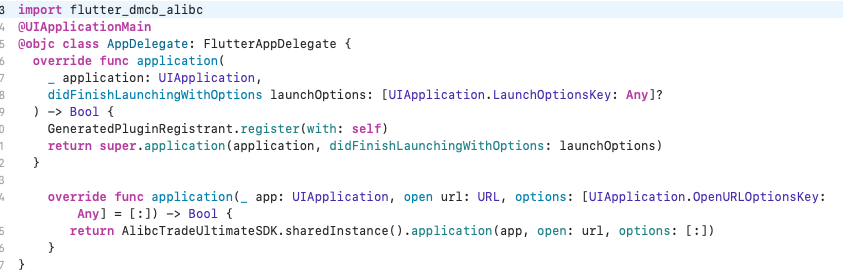

# `flutter_dmcb_alibc`

百川电商SDK Flutter插件.

## 使用指南

> ### 安装
在 `pubspec.yaml` 中添加

```yaml
dependencies:
  flutter_dmcb_alibc:
    git: https://github.com/zenganiu/flutter_dmcb_alibc.git
```
> ### 使用
 ```dart
import 'package:flutter_dmcb_alibc/flutter_dmcb_alibc.dart';

// SDK初始化
final result = await FlutterDmcbAlibc.initAlibc();

// 获取Utdid
final utdid = await FlutterDmcbAlibc.getUtdid();

/// 是否已淘宝授权登录
final hasLogin = await FlutterDmcbAlibc.isLogin();

// 淘宝授权登录
final userInfo = await FlutterDmcbAlibc.authLogin();

// 获取授权用户信息
final userInfo = await FlutterDmcbAlibc.getUserInfo()

// 退出授权登录
FlutterDmcbAlibc.logout();

// 通过商品id在应用内打开商品详情
final res = await FlutterDmcbAlibc.openByCode(
        id: '668413008263', pid: 'mm_1460680056_2101550125_110951050292', relationId: '2763056884');
 ```    

注: 接入文档请参考[官方文档](https://open.taobao.com/docV3.htm?spm=a219a.7386797.0.0.3164669aY2U1pz&source=search&docId=118593&docType=1#5.2)
## iOS端原生工程配置

* 1.目前最新百川只支持使用framework本地依赖[SDK下载地址](http://baichuan-sdk-staged.cn-hangzhou.oss-pub.aliyun-inc.com/52/ios/5.0.0.8/AlibcTradeUltimateSDK_all_package.zip)，Flutter集成只需将SDK中的resource拖入iOS原生宿主工程。
* 2.配置安全图片，注：该版本需使用V6版本的安全图片，V6版本的安全图片可在[《百川套件平台》](https://suite.baichuan.taobao.com/?spm=a219a.15212433.0.0.1ba0669aPCREYJ#/index) 下载
* 3.新增 mtopsdk_configuartion.plist


* 4.配置`URL Types`,`URL Scheme`为`tbopen{AppKey}`,如`tbopen123456`
 
* 5.配置info.plist
  在info.plist中,增加`LSApplicationQueriesSchemes`字段,并添加`tbopen,tmall,taobaolite`,配置ATS, 允许HTTP请求
   
* 6 用户唤端授权回调API （媒体在AppDelegate实现）
  
  
  
## Android端原生工程配置

